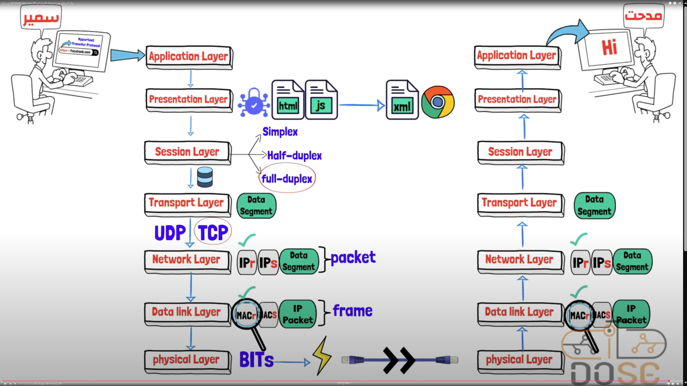
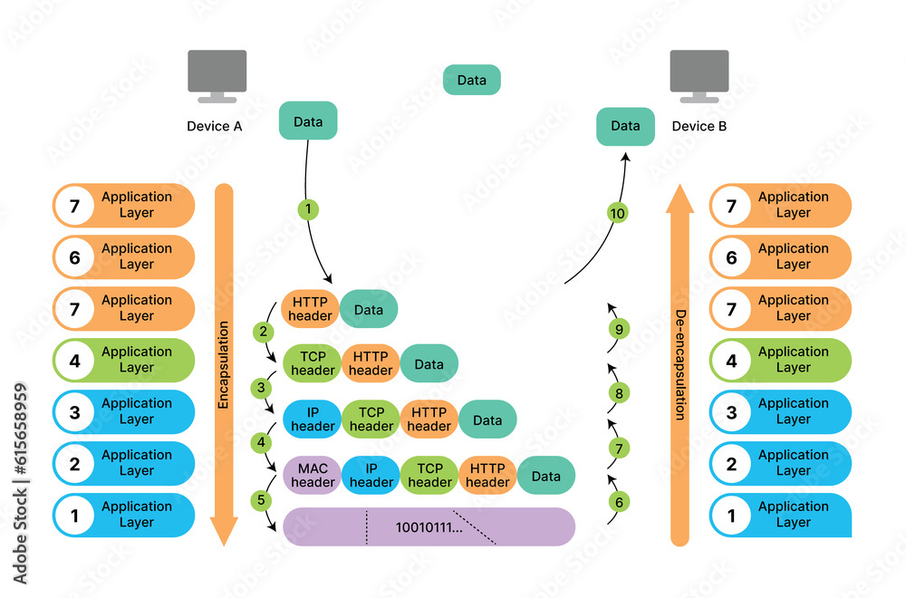

### What Is the OSI Model?
The Open Systems Interconnection (OSI) model describes seven layers that computer systems use to communicate over a network. The OSI model is divided into seven distinct layers, each with specific responsibilities, ranging from physical hardware connections to high-level application interactions.

Each layer of the OSI model interacts with the layer directly above and below it, encapsulating and transmitting data in a structured manner. This approach helps network professionals troubleshoot issues, as problems can be isolated to a specific layer. The OSI model serves as a universal language for networking, providing a common ground for different systems to communicate effectively.

The OSI model was the first standard model for network communications, adopted by all major computer and telecommunication companies in the early 1980s. It was introduced in 1983 by representatives of the major computer and telecom companies, and was adopted by ISO as an international standard in 1984.

The modern Internet is not based on OSI, but on the simpler TCP/IP model. However, the OSI 7-layer model is still widely used, as it helps visualize and communicate how networks operate.

### Why Is the OSI Model Important?
The OSI model provides several advantages for organizations managing networks and communications:

Shared understanding of complex systems: OSI offers a universal language for networking, enabling different network devices and software to communicate. By dividing communication into seven distinct layers, it allows network professionals to isolate and troubleshoot problems effectively.
Faster research and development: Developers can focus on improving specific layers without affecting others, leading to more rapid innovations. This modular approach enables specialization and enables different teams to work on various aspects of network communication simultaneously.
Flexible standardization: The model’s layered approach allows for the integration of new technologies at any layer without disrupting the overall network structure. This ensures compatibility across different devices and protocols, ensuring long-term viability and scalability of network infrastructure.

### The OSI 7 Layers

